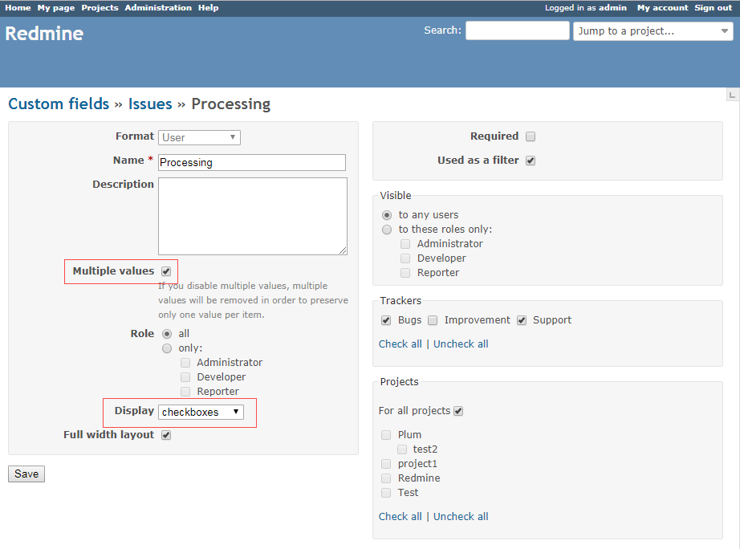
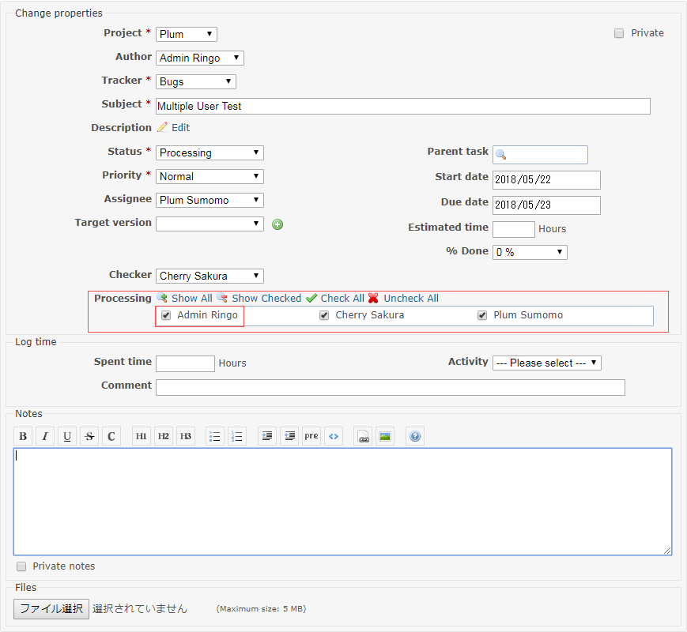
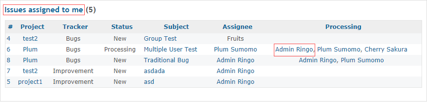
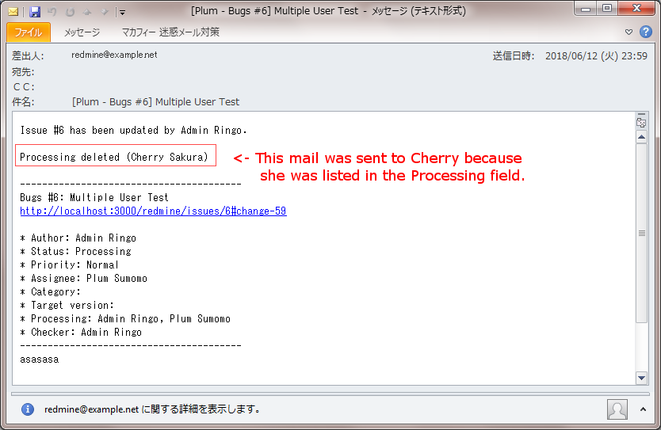
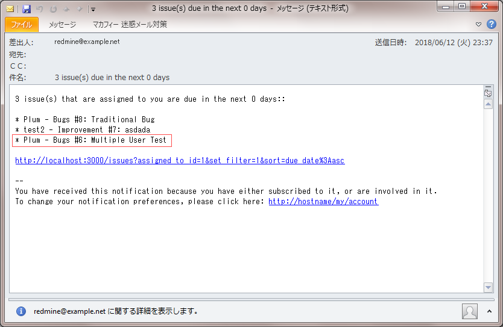

# Expand Custom Users as Assignees plugin
[日本語](README_Ja.md)

Redmine plugin for adding assignee functionality includes default query and reminder to **Custom Users**.  
*) **Custom Users** means the users specified in the **Custom field** of the **User** format

This plugin can realize multiple assignees on issues for review tasks by multiple people use case and so on.
  * send email notifications to **Custom Users who are added or removed** on issues, or all **Custom Users** as broadcast when **Custom Users** are not changed on issues, as well as authors and assignees.
  * send reminder to users set in **Custom Users** on issues
  * issues that **Custom Users** are listed on are queried as assignees such as **"My page" > "Issues assigned to me"**  
    *) Use "just Assignee" field instead to proceed query by the original scope of "assignee".

## Installation

1. To install the plugin

    `git clone` to `plugins/custom_users_as_assignees` on your Redmine path.

        $ cd {RAILS_ROOT}/plugins
        $ git clone https://github.com/preciousplum/custom_users_as_assignees 

2. Restart Redmine.

    Now you should be able to see the plugin in **Administration > Plugins**.  
    *) Migration is **not** required. 

## Compatibility
This plugin version is compatible with Redmine 3.3.0 and later in principle.
However, this plugin has been tested on Redmine 3.4.5 only currently.

## Special Thanks
This plugin was developed based on  notify_custom_users plugin.
https://github.com/Restream/notify_custom_users

## Screen Images
Here are the images used with customfield_checkbox_utility plugin.  https://github.com/preciousplum/customfield_checkbox_utility

  
  
  
  
  